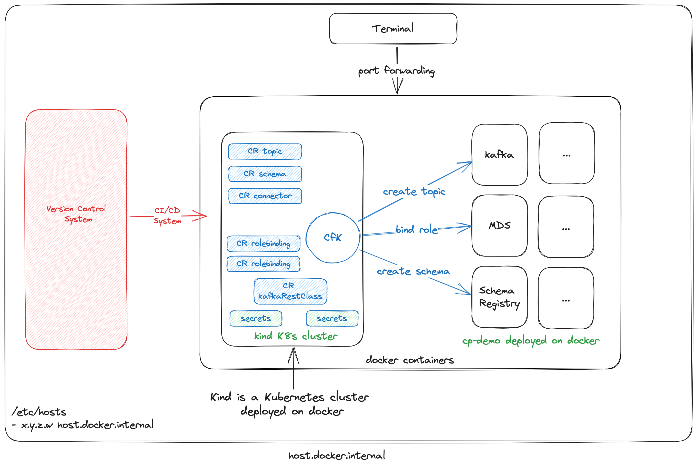

# Goal

Using [cp-demo](https://docs.confluent.io/platform/current/tutorials/cp-demo/docs/overview.html) we will create a topic, schema and give permissions to an user.

## Diagram



## Pre-requisites
- Install kind (https://kind.sigs.k8s.io/docs/user/quick-start/#installation)
- Install helm (https://helm.sh/docs/intro/install/)
- Install kubectl (https://kubernetes.io/docs/tasks/tools/)
- Install docker, jq, docker-compose

## Download this example

```shell
git clone https://github.com/tomasalmeida/cfk-control-plane-cp.git
cd cfk-control-plane-cp/complex-example
```

## Start CP-demo

In order to make this example easier to start, please use the shell script created to quickly start cp-demo. We will not enter into details about CP-demo, in short, it is very useful to test Confluent Platform capabilities.

```shell
./start-cp-demo.sh
```

## Launch Kubernetes cluster and set the needed secrets

Start the Kubernetes cluster and install the CfK

```shell
./start-k8s.sh
```

Install CfK operator

```shell
kubectl create namespace confluent
kubectl config set-context --current --namespace confluent
helm repo add confluentinc https://packages.confluent.io/helm --insecure-skip-tls-verify
helm repo update
# installing with debug enabled
helm upgrade --install confluent-operator confluentinc/confluent-for-kubernetes --namespace confluent --set debug="true"
kubectl get pods -A -o wide
```

Create the bearer secret as super user (this will be the one used to login)

```shell
kubectl create secret generic cp-demo-credential \
     --from-file=bearer.txt=./data/bearer.txt \
     --namespace confluent
```

Create the tls configuration

```shell
kubectl create secret generic cp-demo-tls \
--from-file=tls.crt=./cp-demo/scripts/security/kafka2.certificate.pem \
--from-file=ca.crt=./cp-demo/scripts/security/snakeoil-ca-1.crt \
--from-file=tls.key=./cp-demo/scripts/security/snakeoil-ca-1.key
````

## Create the resources

```shell
kubectl apply -f data
```


## Check on control center

- Go to http://localhost:9021/
- User: superUser / password: superUser
- Cluster > Topics > demo-topic-1
- Check the schema
- Logout
- Go to http://localhost:9021/
- User: alice / password: alice-secret
- Cluster > Topics > demo-topic-1
- Only this topic is visible


## Via CLI

```shell
confluent login --url https://localhost:8091 --ca-cert-path cp-demo/scripts/security/snakeoil-ca-1.crt
 KAFKA_CLUSTER_ID=$(curl -s https://localhost:8091/v1/metadata/id --tlsv1.2 --cacert cp-demo/scripts/security/snakeoil-ca-1.crt | jq -r ".id")
confluent iam rbac role-binding list --principal Group:KafkaDevelopers --connect-cluster connect1 --kafka-cluster $KAFKA_CLUSTER_ID
confluent iam rbac role-binding list --principal Group:KafkaDevelopers --kafka-cluster $KAFKA_CLUSTER_ID
```

## Show the log of the Confluent Operator

```shell
kubectl -n confluent logs -l "app.kubernetes.io/name=confluent-operator"
```

## Shutdown

```shell
./stop-all.sh
```
